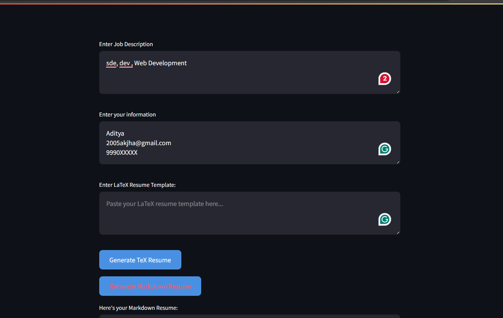
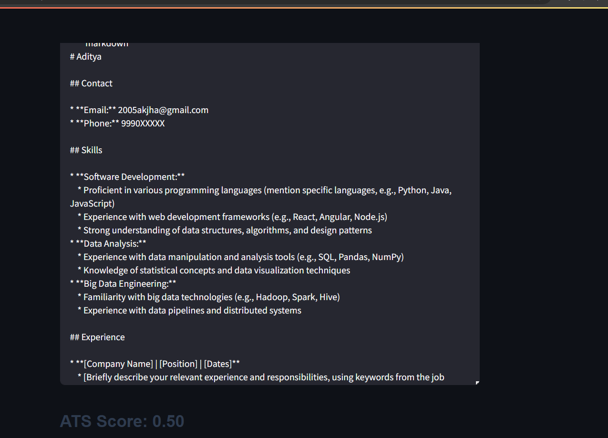

# ATS-RESUME-GENERATOR


## Overview

Resume Copilot is a Streamlit application designed to help users generate ATS (Applicant Tracking System) optimized resumes using AI technology.

## Features

- Generate resumes in TeX or Markdown format based on user input (job description, personal information, resume template).
- Evaluate ATS compatibility by providing an ATS score and matched keywords.
- User-friendly interface with input fields and buttons for generating resumes.
- Customizable CSS for a modern and stylish look.

## Setup Instructions

1. **Clone the repository:**

   ```bash
   git clone https://github.com/adityajha2005/gptresume_builder
   cd resume-copilot
   ```

2. **Install dependencies:**

   Ensure you have Python and pip installed. Then, install the required Python packages:

   ```bash
   pip install -r requirements.txt
   ```

3. **Set up Google API Key:**

   Obtain a Google API key for the Generative AI service and set it as an environment variable named `GOOGLE_API_KEY`. Follow instructions from [Google Developers Console](https://console.developers.google.com/apis/api/generativelanguage.googleapis.com/overview?project=your-project-id).

4. **Run the application:**

   ```bash
   streamlit run main.py
   ```

   Open your web browser and go to `http://localhost:8501` to view the application.

## Usage

1. **Enter Job Description:** Provide details of the job you are applying for.
2. **Enter Your Information:** Input your personal information.
3. **Enter LaTeX Resume Template (optional):** Paste your LaTeX template for the resume.
4. **Generate Resume:**
   - Click on "Generate TeX Resume" or "Generate Markdown Resume" to create your resume.
   - The generated resume will appear in the text area below.
5. **ATS Evaluation:**
   - After generating the resume, an ATS score will be displayed indicating the percentage of keywords matched from the job description.
   - Matched keywords will also be listed to help you understand the ATS optimization.

## Example

()

## License

This project is licensed under the MIT License - see the [LICENSE](LICENSE) file for details.

---

